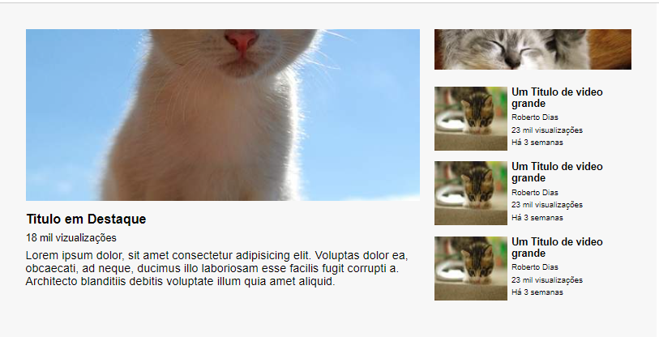

# Projeto Reprodução de Tela YouTube

## Descrição
    Esta é a solução do exercício proposto pelo Dev em Dobro com o intuito de reproduzir a tela de video do youtube utilizando flex grid e flex box.

## Meu Processo

    •	Marcação semântica HTML5
    •	Propriedades personalizadas de CSS3
    •	Flexbox
    •	Flexgrid

## Design

### Desktop

## Autor

 GitHub: <a href="https://github.com/devkarine">DevKarine</a>  
FrontEndMentor: <a href="https://www.frontendmentor.io/profile/devkarine">@devkarine</a>  
CodePen: <a href="https://codepen.io/devkarine">DevKarine</a>  
linkedIn: <a href="https://www.linkedin.com/in/devkarine/">Karine Pereira</a>